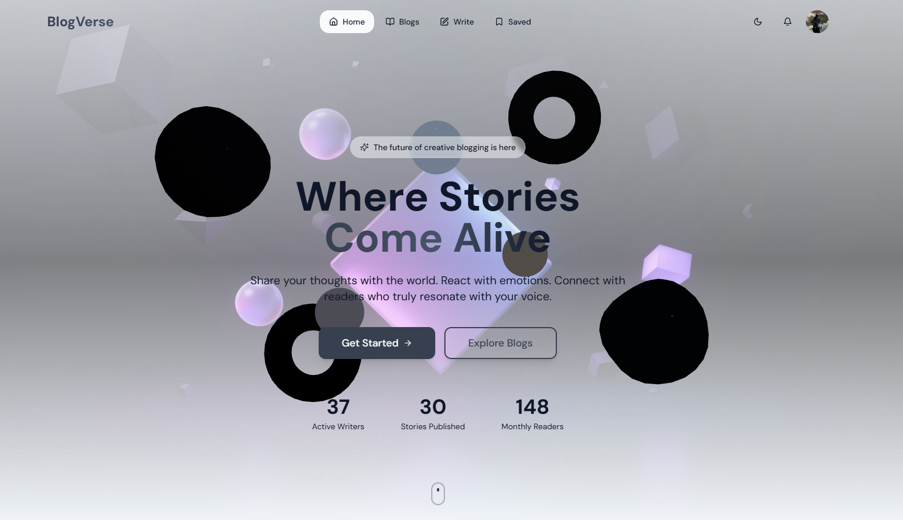
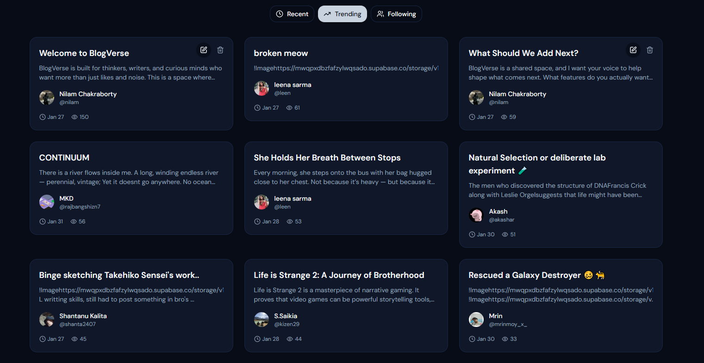
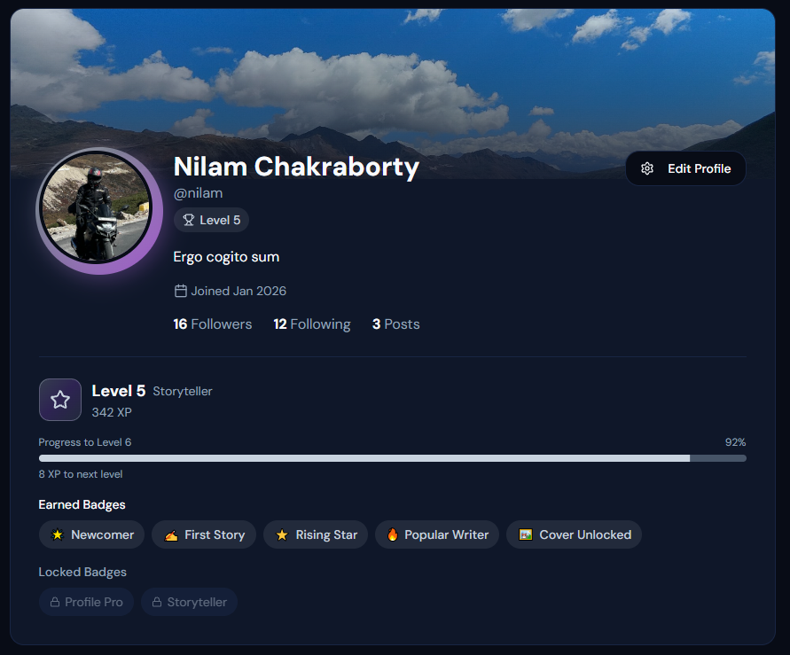
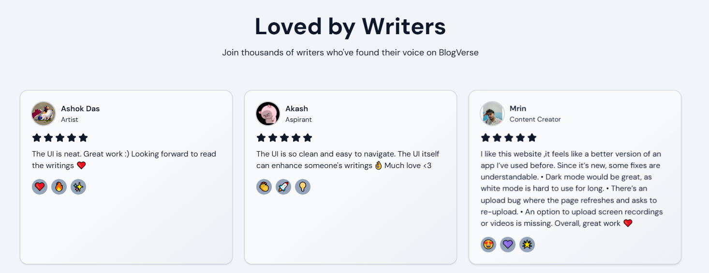
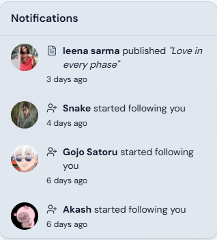
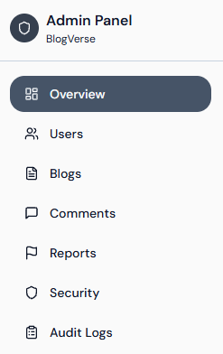

# BlogVerse

[](https://blog-verse-app-delta.vercel.app)

Welcome to **BlogVerse**, a modern, creator-first blogging platform designed for thoughtful writing, emotional reactions, and meaningful community interaction.

---

## Live Status Badges

<p align="center">
  
  
  
  
</p>

---

## 📸 Screenshots

### 🏠 Landing Page


### 📚 Feed / Blog List


### 👤 Profile Page


### ⭐ Loved By Writers


### 🔔 Notifications (Mobile & Desktop)


### 🛠 Admin Dashboard


---

## 💡 What Is BlogVerse?

BlogVerse is not just another blogging app — it’s a **minimal, expressive, and engaging platform** built for creators who value conversation over scrolling.

With:
- Google Authentication
- Tag-based content discovery
- Followers & notifications
- Reactions (emoji based)
- Profile progression system
- Clean mobile navigation  
BlogVerse is an experience first, feed second.

---

## 🧠 Core Features

### ✍️ Blogging

- Rich blog editor with images
- Tagging system for discovery
- Edit your own blogs
- View counts reflect every open
- Responsive reading environment

---

### 👥 Profiles & Social

- Google Login
- Custom bio + designation
- Followers / Following lists
- Profile leveling and badges
- Optional cover photos when unlocked
- Notifications for follows & new posts

---

### 🔔 Notifications

Realtime feed alerts for:
- New followers
- New blog posts
- Unread / read state
- Mobile alerts with tap navigation

---

### 📱 Mobile-First Navigation

Instagram-style bottom tab bar:
- Home
- Blogs
- Write
- Notifications
- Profile

Fully optimized for Android / iOS screens.

---

## 🎨 Theme & UX

- Light / Dark theme toggle
- Smooth interactions
- Skeleton loaders
- Snackbar feedback
- Accessible and refined UI

---

## 🗂 Tech Stack

| Layer | Technology |
|-------|------------|
| Frontend | React + Vite |
| Styling | Tailwind CSS |
| Icons | Lucide Icons |
| Backend | Supabase (Auth, DB, Storage) |
| Hosting | Vercel |
| Authentication | Google OAuth |

---

## 🚦 Quick Start (Local Dev)

**Prerequisites:**
- Node.js 18+
- npm / pnpm

```bash
git clone https://github.com/NilamXSC/BlogVerse-App.git
cd BlogVerse-App
npm install
npm run dev
Visit http://localhost:5173
```

🔐 Environment Variables
```txt
Create .env:

VITE_GOOGLE_CLIENT_ID=<your-google-client-id>
VITE_APP_NAME=BlogVerse


Only VITE_ prefixed vars are exposed to client.
```
📌 Tagging & Navigation
```txt
Blog posts use a proper tag system:

Click a tag to explore related blogs

Tag view page shows all tagged content

URL Example:

/tag/technology

🧬 Profile Level & Badges

Profiles earn levels by:

Signing up

Completing profile

Publishing a blog

Gaining followers

Achieving high engagement

Level 5 users get a special visual effect to highlight experience.
```
## 💬 Community Feedback

Real feedback powers the Loved By Writers section with stars and comments from actual users.

## 🌐 Live Link

👉 https://blog-verse-app-delta.vercel.app

🤝 Contributing

Suggestions, issues, and pull requests are welcome.
Please follow conventional commits and maintain consistent formatting.
---
## 📄 License

MIT © 2026 BlogVerse

Thank you for being part of this journey ❤️
Build something real.
Build it on BlogVerse.


---
